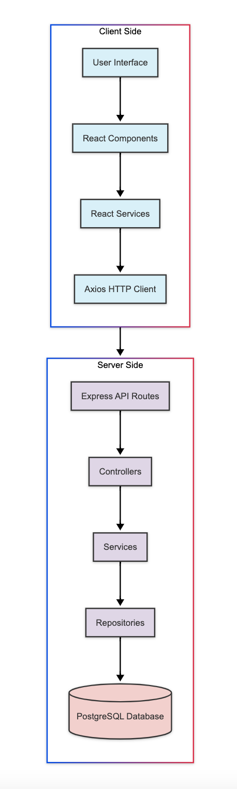
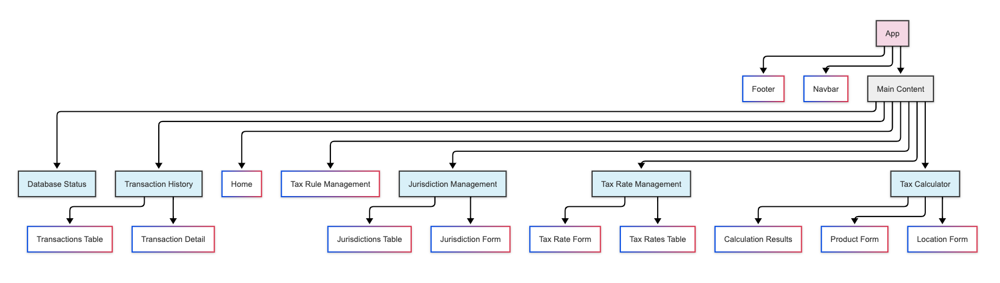
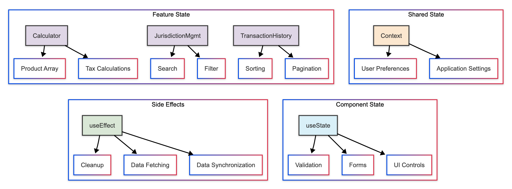
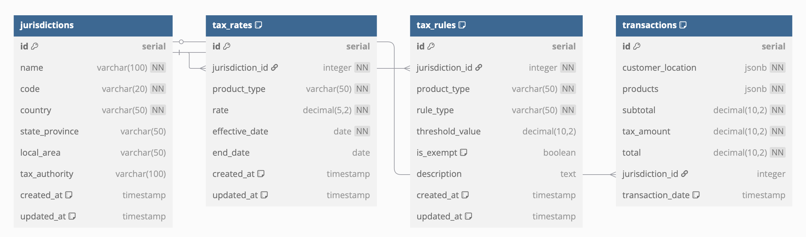

# E-Commerce Tax Calculator - Technical Documentation

## Table of Contents
- [Project Overview](#project-overview)
- [Why I Built This Project](#why-i-built-this-project)
- [Technology Stack](#technology-stack)
  - [Frontend Technologies](#frontend-technologies)
  - [Backend Technologies](#backend-technologies)
- [Application Architecture](#application-architecture)
  - [Client-Side Architecture](#client-side-architecture)
  - [Server-Side Architecture](#server-side-architecture)
  - [Data Flow](#data-flow)
  - [State Management Approach](#state-management-approach)
- [Key Features Explained](#key-features-explained)
  - [Tax Calculator](#tax-calculator)
  - [Jurisdiction Management](#jurisdiction-management)
  - [Tax Rate Management](#tax-rate-management)
  - [Transaction History](#transaction-history)
- [User Interface Design](#user-interface-design)
  - [Responsive Design](#responsive-design)
  - [Accessibility Considerations](#accessibility-considerations)
- [Performance Considerations](#performance-considerations)
- [Backend Implementation](#backend-implementation)
  - [API Design](#api-design)
  - [Database Models](#database-models)
  - [Security Considerations](#security-considerations)
- [Testing Approach](#testing-approach)
- [Challenges and Solutions](#challenges-and-solutions)
  - [Challenge 1: Complex Tax Rules](#challenge-1-complex-tax-rules)
  - [Challenge 2: Data Management](#challenge-2-data-management)
  - [Challenge 3: User Experience for Complex Tasks](#challenge-3-user-experience-for-complex-tasks)
- [Interview Questions and Answers](#interview-questions-and-answers)
  - [1. How did you approach the architecture of this application?](#1-how-did-you-approach-the-architecture-of-this-application)
  - [2. What was the most challenging aspect of building this application?](#2-what-was-the-most-challenging-aspect-of-building-this-application)
  - [3. What is state management and how did you handle it in this application?](#3-what-is-state-management-and-how-did-you-handle-it-in-this-application)
  - [4. How did you handle error management in the application?](#4-how-did-you-handle-error-management-in-the-application)
  - [5. How did you implement and optimize the PostgreSQL database for this application?](#5-how-did-you-implement-and-optimize-the-postgresql-database-for-this-application)
- [Conclusion](#conclusion)

## Project Overview

The E-Commerce Tax Calculator is a web application I built to help online businesses calculate sales taxes across different regions. This document explains how the application works and the technical decisions I made during development.

## Why I Built This Project

Online businesses face complex tax regulations that vary by location. This application solves several key problems:

1. **Tax Calculation Complexity**: Automatically determines correct tax rates based on customer location and product types
2. **Compliance Management**: Helps businesses follow tax laws in different jurisdictions
3. **Record Keeping**: Maintains a history of transactions for reporting and auditing

## Technology Stack

### Frontend Technologies
- **React.js**: A JavaScript library for building user interfaces with reusable components
- **React Router**: Enables navigation between different pages without reloading the browser
- **CSS3**: Custom styling with responsive design considerations
- **Axios**: A library that simplifies making HTTP requests to the server

### Backend Technologies
- **Node.js**: A JavaScript runtime that executes code outside a web browser
- **Express.js**: A web framework that simplifies creating API endpoints
- **PostgreSQL**: A powerful, open-source relational database system
- **pg**: A PostgreSQL client for Node.js with connection pooling support

## Application Architecture

The application follows a client-server architecture with clear separation of concerns:



This diagram illustrates the complete flow of data through the application, from user interface to database and back.

### Client-Side Architecture

I organized the frontend using a component-based architecture:

1. **User Interface**: The visual elements users interact with
2. **React Components**: Reusable UI building blocks that manage their own state
3. **React Services**: Handle business logic and data processing on the client
4. **Axios HTTP Client**: Manages API communication with the server

#### Component Hierarchy

The React application is structured with a clear component hierarchy:



This diagram shows how components are organized:

- **App**: The root component that sets up routing and the overall structure
- **Main Layout Components**: Navbar, Main Content, and Footer provide the application shell
- **Page Components**: Each major feature has its own page component (Tax Calculator, Jurisdiction Management, etc.)
- **UI Components**: Specialized components for forms, tables, and results displays

This hierarchical structure promotes reusability and maintainability by breaking the UI into logical, manageable pieces.

### Server-Side Architecture

The backend is designed with a layered architecture:

1. **Express API Routes**: Define endpoints and handle HTTP requests/responses
2. **Controllers**: Process requests and coordinate the appropriate services
3. **Services**: Implement business logic and orchestrate data operations
4. **Repositories**: Handle database interactions and data persistence
5. **PostgreSQL Database**: Stores all application data in a relational structure

This separation allows for better organization and testability of the server-side code.

### Data Flow

The application follows a clear data flow pattern:

1. **Client-Side Flow**:
   - User interacts with the interface (enters product information, selects location)
   - React components capture this input and pass it to service functions
   - Service functions make API calls to the server
   - Components update to display the results returned from the server

2. **Server-Side Flow**:
   - API endpoints receive requests from the client
   - Controllers validate the incoming data
   - Service functions process the business logic (tax calculations, data operations)
   - Data is retrieved from or saved to the database
   - Results are formatted and returned to the client

This bidirectional flow ensures clean separation between presentation and business logic.

### State Management Approach

I implemented a comprehensive state management strategy to handle the complex data relationships in this application:



The diagram above illustrates the four key aspects of state management in the application:

#### Component State
Using React's `useState` hook, I managed local component state for:
- Form inputs and validation
- UI control states (expanded/collapsed, selected tabs)
- Component-specific display options

#### Side Effects
With the `useEffect` hook, I handled:
- Data fetching from the API
- Synchronization between different state values
- Cleanup operations to prevent memory leaks

#### Feature State
Each major feature manages its own specialized state:
- **Tax Calculator**: Manages product arrays and calculation results
- **Jurisdiction Management**: Handles search and filtering functionality
- **Transaction History**: Controls pagination and sorting options

#### Shared State
For application-wide state, I used React Context to manage:
- User preferences (theme, display options)
- Application settings (API endpoints, configuration)

This layered approach to state management ensures that data flows predictably through the application while maintaining good performance and separation of concerns.

## Key Features Explained

### Tax Calculator

The Tax Calculator is the main feature of the application. Here's how it works:

#### User Interaction
1. The user enters customer location information (country, state)
2. The user adds products with details (name, type, price, quantity)
3. When the user clicks "Calculate Tax," the application:
   - Identifies which tax jurisdiction applies based on location
   - Finds the correct tax rates for each product type
   - Applies any special rules or exemptions
   - Calculates the final tax amount and total price

#### Technical Implementation
```javascript
// This function calculates tax for a set of products in a specific location
function calculateTax(products, customerLocation) {
  // Step 1: Find the applicable tax jurisdiction based on location
  const jurisdiction = findJurisdictionByLocation(customerLocation);
  
  // Step 2: Calculate the pre-tax total (subtotal)
  const subtotal = products.reduce((total, product) => {
    return total + (product.price * product.quantity);
  }, 0);
  
  // Step 3: Calculate tax for each product
  let totalTaxAmount = 0;
  const itemizedTaxes = products.map(product => {
    // Get the tax rate for this product type in this jurisdiction
    const taxRate = getTaxRate(jurisdiction.id, product.type);
    
    // Check if this product is exempt from tax
    const isExempt = checkForExemption(jurisdiction.id, product.type);
    
    // Apply any special tax rules
    const finalRate = applySpecialRules(taxRate, product, jurisdiction);
    
    // Calculate the tax amount for this product
    const taxAmount = isExempt ? 0 : (product.price * product.quantity * finalRate);
    
    // Add to the running total
    totalTaxAmount += taxAmount;
    
    // Return details for this product's tax calculation
    return {
      productId: product.id,
      taxRate: finalRate,
      taxAmount: taxAmount,
      isExempt: isExempt
    };
  });
  
  // Step 4: Return the complete calculation results
  return {
    subtotal: subtotal,
    taxAmount: totalTaxAmount,
    total: subtotal + totalTaxAmount,
    itemizedTaxes: itemizedTaxes,
    jurisdictionName: jurisdiction.name
  };
}
```

This function demonstrates how I implemented the tax calculation logic in a clear, step-by-step approach.

### Jurisdiction Management

The Jurisdiction Management feature allows users to set up and manage tax jurisdictions (like states or countries).

#### What It Does
- Creates, updates, and deletes tax jurisdictions
- Organizes jurisdictions hierarchically (country > state > local)
- Validates jurisdiction data to prevent errors
- Provides search and filtering to find specific jurisdictions

#### How I Built It
I created a form interface that communicates with the data services to manage jurisdiction data. The form includes validation to ensure all required fields are completed correctly.

### Tax Rate Management

The Tax Rate Management feature handles the different tax rates that apply to various product types.

#### Key Capabilities
- Sets different tax rates based on product type and location
- Supports effective dates so rates can change over time
- Validates rates to ensure they're within legal limits
- Allows management of multiple rates

#### Implementation Details
I used a table-based interface with form editing capabilities, making it easy for users to view and modify tax rates. The system validates all changes to prevent errors.

### Transaction History

The Transaction History feature keeps a record of all tax calculations performed.

#### Features
- Displays a list of past transactions
- Shows detailed information about each transaction
- Allows filtering by date, amount, and other criteria
- Supports viewing transaction details

#### Technical Approach
I implemented filtering and search functionality using PostgreSQL's built-in search capabilities. The search queries the transactions table in the database directly, allowing users to efficiently find specific transactions by various fields like date, amount, and jurisdiction. This database-level search provides fast results even with large transaction histories.

## User Interface Design

### Responsive Design

I built the interface with responsive design principles:

1. **Flexible Layouts**: Used CSS to create layouts that adapt to different screen sizes
2. **Media Queries**: Added specific adjustments for different viewport sizes
3. **Consistent Components**: Designed UI components that work across device sizes
4. **Responsive Tables**: Implemented tables that can be viewed on smaller screens

### Accessibility Considerations

I included several accessibility features:

1. **Semantic HTML**: Used appropriate HTML elements for their intended purpose
2. **Color Contrast**: Ensured sufficient contrast between text and background colors
3. **Form Labels**: Added proper labels for all form elements
4. **Error Messages**: Provided clear error messages for form validation

## Performance Considerations

To ensure good performance, I implemented:

1. **Efficient State Management**: Used React's useState and useEffect hooks appropriately
2. **Conditional Rendering**: Only rendered components when needed
3. **Form Validation**: Validated user input to prevent unnecessary processing
4. **Optimized Rendering**: Structured components to minimize unnecessary re-renders

## Backend Implementation

### API Design

The application is designed to work with a RESTful API. Here's the API structure:

```
// Jurisdiction endpoints
GET    /api/jurisdictions     - Get all jurisdictions
POST   /api/jurisdictions     - Create a new jurisdiction
GET    /api/jurisdictions/:id - Get a specific jurisdiction
PUT    /api/jurisdictions/:id - Update a jurisdiction
DELETE /api/jurisdictions/:id - Delete a jurisdiction

// Tax Rate endpoints
GET    /api/tax-rates         - Get all tax rates
POST   /api/tax-rates         - Create a new tax rate
GET    /api/tax-rates/:id     - Get a specific tax rate
PUT    /api/tax-rates/:id     - Update a tax rate
DELETE /api/tax-rates/:id     - Delete a tax rate

// Tax Calculation and Transaction endpoints
POST   /api/calculate-tax     - Calculate tax for a transaction
GET    /api/transactions      - Get transaction history
GET    /api/transactions/:id  - Get a specific transaction
```

### Database Models

I designed the database schema in PostgreSQL with these structures:



This Entity-Relationship Diagram shows the relationships between:
- Jurisdictions (primary entity)
- Tax rates (associated with jurisdictions and product types)
- Tax rules (defining special conditions for taxation)
- Transactions (recording completed tax calculations)

The schema implements proper foreign key relationships and includes strategic indexes for performance optimization.

### Security Considerations

I considered several security aspects:

1. **Input Validation**: Validated all user input to prevent injection attacks
2. **Form Security**: Implemented proper form validation and sanitization
3. **Error Handling**: Created appropriate error handling to avoid exposing sensitive information

## Testing Approach

My testing strategy included:

1. **Manual Testing**: Thoroughly tested all features manually
2. **Cross-browser Testing**: Verified functionality across different browsers
3. **Responsive Testing**: Tested the application at various screen sizes
4. **Form Validation Testing**: Verified that all form validation works correctly

## Challenges and Solutions

### Challenge 1: Complex Tax Rules

**Problem**: Tax rules vary significantly between jurisdictions and can include complex conditions.

**Solution**: I created a flexible approach to handle various types of rules:
- Different tax rates by jurisdiction and product type
- Support for tax exemptions
- Effective dating for tax rates

### Challenge 2: Data Management

**Problem**: The application needed to manage relationships between jurisdictions, tax rates, and transactions.

**Solution**: I implemented:
- Clear data models with appropriate relationships
- Services to handle data operations
- Form interfaces for data management

### Challenge 3: User Experience for Complex Tasks

**Problem**: Tax management involves complex tasks that could overwhelm users.

**Solution**: I improved the user experience by:
- Breaking complex forms into logical sections
- Providing clear feedback and validation messages
- Adding search and filter capabilities to help users find what they need
- Creating intuitive interfaces for each management section

## Interview Questions and Answers

### 1. How did you approach the architecture of this application?

I designed the application with a clear separation between client and server responsibilities:

**Client-Side Architecture:**
- **Presentation Layer**: React components organized by feature (calculator, jurisdictions, tax rates)
- **State Management**: Used React hooks for local state and shared state between components
- **Service Layer**: Created service modules to handle API communication and data processing
- **Routing**: Implemented React Router for navigation between different sections

**Server-Side Architecture:**
- **API Layer**: Designed RESTful endpoints following resource-based conventions
- **Controller Layer**: Separated request handling from business logic
- **Service Layer**: Implemented core business logic including tax calculations
- **Data Access Layer**: Created models and queries for database operations

This full-stack approach allowed me to:
1. Maintain clear separation of concerns
2. Create reusable components and services
3. Ensure the application is testable at all levels
4. Make the codebase more maintainable and extensible

For communication between layers, I implemented a consistent pattern where components call services, services make API requests, and the server processes these requests through its layered architecture before returning responses.

### 2. What was the most challenging aspect of building this application?

The most challenging aspect was implementing the tax calculation logic to handle the variety of tax rules across different jurisdictions. Each location can have different:

- Base tax rates
- Product-specific rates
- Exemptions
- Effective dates

To solve this, I created a structured approach to tax calculation that could handle these variations. I also implemented comprehensive validation to ensure the data entered was correct and consistent.

### 3. What is state management and how did you handle it in this application?

**State management** refers to how an application tracks, maintains, and updates its data over time. In React applications, state represents the current condition of the UI and its data at any given moment. Effective state management is crucial because it:

1. **Determines what users see**: The UI reflects the current state
2. **Controls application behavior**: Different states trigger different behaviors
3. **Maintains data consistency**: Ensures all parts of the application have access to the same data
4. **Affects performance**: Poor state management can lead to unnecessary re-renders

In this E-Commerce Tax Calculator application, state management was particularly important because of the complex data relationships between jurisdictions, tax rates, and calculations. I implemented a comprehensive approach:

**Local Component State:**
- Used React's `useState` hook for component-specific data like form inputs, toggle states, and local UI conditions
- Implemented `useReducer` for more complex state logic in the tax calculator where multiple state updates needed to happen together

**Side Effect Management:**
- Applied `useEffect` hook to handle data fetching, synchronization, and cleanup operations
- Controlled when effects should run using dependency arrays to prevent unnecessary operations

**Form State Management:**
- Created controlled components where React manages all form inputs
- Implemented validation logic that updates state in real-time to provide immediate feedback
- Maintained complex nested form state for the tax calculator's product entries

**Cross-Component State Sharing:**
- Used "lifting state up" pattern for closely related components that needed to share data
- Implemented React Context API for global application state like user preferences and application settings
- Created custom hooks to encapsulate and reuse state logic across different components

**Feature-Specific State Management:**
- **Tax Calculator**: Managed arrays of product objects with their individual properties
- **Jurisdiction Management**: Implemented search and filter state to handle large datasets efficiently
- **Transaction History**: Created pagination state to improve performance with large transaction lists

This layered approach to state management provided several benefits:

1. **Predictable Data Flow**: Clear patterns for how data changes and flows through the application
2. **Optimized Performance**: Components only re-render when their specific state changes
3. **Maintainable Code**: State logic is isolated and easier to debug
4. **Scalable Architecture**: The approach can accommodate growing application complexity

By thoughtfully designing the state management strategy, I created a robust application that handles complex data relationships while maintaining good performance and user experience.

### 4. How did you handle error management in the application?

I implemented error handling at multiple levels:

1. **Form Validation**: Validated user input before submission
2. **Service Layer Errors**: Handled errors in data operations
3. **UI Error States**: Displayed appropriate error messages to users
4. **Graceful Degradation**: Ensured the application remained usable even when errors occurred

This multi-layered approach helped create a more robust application that could handle unexpected situations gracefully.

### 5. How did you implement and optimize the PostgreSQL database for this application?

The PostgreSQL database implementation was a critical part of this application. Here's how I approached it:

**Database Schema Design:**
- I designed a normalized schema with clear entity relationships (jurisdictions, tax rates, rules, transactions)
- Used appropriate data types for each column (VARCHAR for text, DECIMAL for monetary values, JSONB for complex data)
- Implemented constraints to maintain data integrity (NOT NULL, UNIQUE, CHECK constraints, foreign keys)
- Created a schema that balances normalization with query performance

**Performance Optimizations:**
- **Strategic Indexing**: Added indexes on frequently queried columns:
  ```sql
  CREATE INDEX idx_tax_rates_jurisdiction_product ON tax_rates(jurisdiction_id, product_type);
  CREATE INDEX idx_transactions_date ON transactions(transaction_date);
  ```
- **Connection Pooling**: Implemented connection pooling to efficiently manage database connections:
  ```javascript
  // Database connection with pooling
  const pool = new Pool({
    user: process.env.DB_USER,
    host: process.env.DB_HOST,
    database: process.env.DB_NAME,
    password: process.env.DB_PASSWORD,
    port: process.env.DB_PORT,
    max: 20, // Maximum number of clients in the pool
    idleTimeoutMillis: 30000 // Close idle clients after 30 seconds
  });
  ```
- **Query Optimization**: Wrote efficient SQL queries with proper JOINs and WHERE clauses
- **Query Logging**: Added query logging to identify slow queries:
  ```javascript
  const query = async (text, params) => {
    const start = Date.now();
    try {
      const result = await pool.query(text, params);
      const duration = Date.now() - start;
      console.log('Executed query', { text, duration, rows: result.rowCount });
      return result;
    } catch (error) {
      console.error('Query error', { text, error });
      throw error;
    }
  };
  ```

**Advanced PostgreSQL Features:**
- **JSONB for Complex Data**: Used JSONB data type for storing product details and customer location:
  ```sql
  CREATE TABLE transactions (
    id SERIAL PRIMARY KEY,
    customer_location JSONB NOT NULL,
    products JSONB NOT NULL,
    -- other fields...
  );
  ```
- **Transactions**: Implemented database transactions for operations that require atomicity:
  ```javascript
  const client = await pool.connect();
  try {
    await client.query('BEGIN');
    // Multiple database operations...
    await client.query('COMMIT');
  } catch (error) {
    await client.query('ROLLBACK');
    throw error;
  } finally {
    client.release();
  }
  ```
- **Constraints**: Added CHECK constraints to ensure data validity:
  ```sql
  CONSTRAINT valid_rate CHECK (rate >= 0 AND rate <= 100)
  ```

**Data Access Layer:**
- Created a repository pattern to abstract database operations
- Implemented proper error handling for database queries
- Used parameterized queries to prevent SQL injection:
  ```javascript
  const result = await db.query(
    'SELECT * FROM jurisdictions WHERE country = $1 AND state_province = $2',
    [country, state]
  );
  ```

**Testing and Monitoring:**
- Added a health check endpoint to verify database connectivity
- Implemented a database status page in the UI to monitor connection status
- Created database initialization scripts for consistent setup

This comprehensive approach to database implementation ensured that the application had reliable data storage with good performance characteristics, even as the dataset grows over time.

## Conclusion

The E-Commerce Tax Calculator demonstrates my ability to:

1. **Solve Complex Business Problems**: I translated tax regulations into a user-friendly application
2. **Build React Applications**: I created components that work together to provide a complete solution
3. **Write Clean, Maintainable Code**: I organized the code using best practices and clear patterns
4. **Design Intuitive Interfaces**: I created interfaces that make complex tasks manageable
5. **Implement Business Logic**: I developed the logic needed to handle tax calculations correctly

This project showcases my technical skills in React and frontend development, as well as my ability to understand and implement business requirements.

